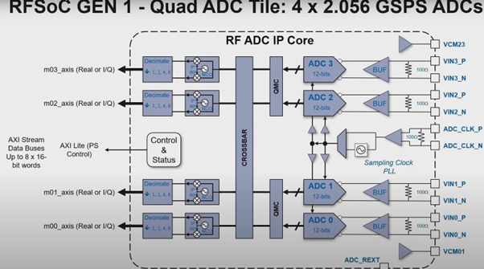
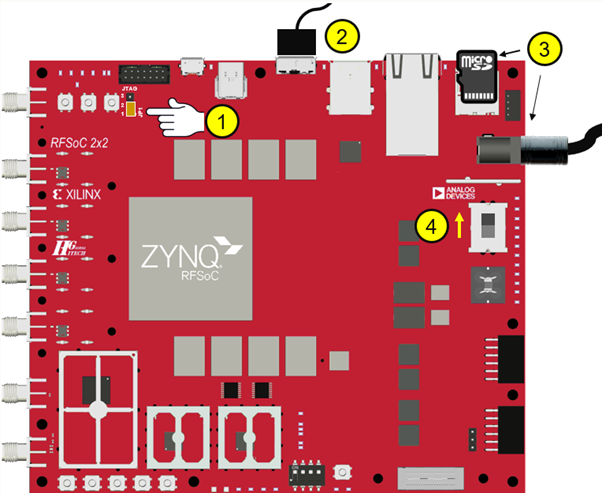
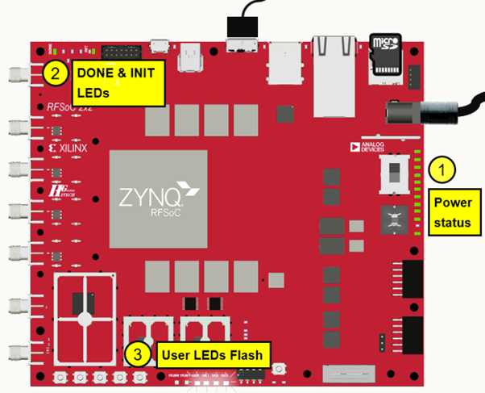

# Introduction

 The RFSoC 2x2 board is an SDR board that can be used to emulate a radio system. The 2x2 has high speed RF ADCs (2 no.s) to sample RF signals directly without the need of any mixer circuitry, which is then sent to the ZYNQ Ultrascale+ chip on the board; it also has 2 RF DACs to transmit data out from the board. The ZYNQ Ultrascale+ chip contains 2 processing components, that is, a set of ARM core processors (Processing System) and an FPGA (Programmable Logic) along with some memory elements such as DRAMs. The ARM core processors act as the host and the FPGA acts as the target. Using a framework called PYNQ we can communicate with the processing system through a browser where the browser acts as the terminal to send commands as well as a UI front end to display received data.

The RFSoC's architecture is as below.

This [link](http://www.rfsoc-pynq.io/rfsoc_2x2_overview.html) has detailed information on the RFSoC's architecture.

**Important:** The RFSoC 2x2 board has been discontinued and most links leading from the above link would be redirected to the corresponding pages for the RFSoC 4x2. To go to the 2x2 board's corresponding page please replace the "….4x2…." in the URL to "….2x2…."

Example: When a link for the 2x2 is selected a 4x2 page is loaded with the following URL

To go to the 2x2 page, the URL can be changed to

# Loading Image onto RFSoC 2x2 board

Steps to follow to load a PYNQ image

**Step 1:** Download the image from the above link.

Note: This [link](http://www.pynq.io/board.html) contains the latest standard PYNQ RFSoC 2x2 image which can be downloaded.

**Step 2:** Flash image onto microSD card.

**Note:** The RFSoC comes with an SD card that has a preloaded image, but if one needs to boot up a different or the latest image, they can do so by flashing said image on a microSD card. The recommended size of the microSD card is 16GB as the standard RFSoC image is 8+GB.

**Note:** Balena-Etcher is recommended for flashing the image onto the microSD as certain other flashing software do not perform the necessary CRC check on the image post flash, which could cause a corrupted file to be left in the SD card.

**Note:** For information on how to build SD card images, visit this [link](https://pynq.readthedocs.io/en/latest/pynq_sd_card.html).

**Step 3:** Insert the microSD card on the board. Ensure that the pins 1 & 2 on jumper JP1/JTAG _(1)_ are Connected to configure the board to boot from SD Card.

**Step 4:** Connect the microUSB 3.0cable to port _(2)_ as shown above and the other end (USB) to a computer. If a microUSB 3.0 cable isn't available, a microUSB 2.0 cable works too (the port is backwards compatible). And also connect the power cable to the board.

**Note:** The device is connected to the computer through an Ethernet via USB link and so it appears on the system as an IP address.

**Step 5:** Flip the switch marked _(4)_ on the above image.

At first, 11 out of the 12 Power status LEDs start glowing as shown above _(1)_. After about 40 seconds the Init and Done LEDs _(2)_ start glowing green. And a few seconds later the User LEDs start flashing for a few seconds. After that, when User LEDs glow solid, it implies that the boot sequence is complete and successful.

**Important:** If the Init and Done LEDs both glow in red immediately after the power is turned on in boot mode, it implies that the image is either the wrong one or is corrupted and needs to be changed.

# Connecting to the board

Once the boot sequence is finished, the board can be accessed with a browser. On the URL bar type

https:192.168.3.1:9090/lab

This is the default IP Address of a 2x2 board. The /lab part gives us access to the entire Jupyter lab instead of just the notebook, thus providing extra features such as a terminal.

Once the URL is entered Jupyter lab opens with certain getting started files and example files. These files contain PYNQ examples such as Spectrum Analyser where the user can transmit a tone at a certain frequency from the 2x2 board and receive a certain band on the same board 2x2. The received and sampled signals are processed to give a spectrum around the centre frequency set for the receiver, and if the transmitted signal is within this band a tone can be seen.

# Overlays

Overlays, or hardware libraries, are programmable/configurable FPGA designs that extend the user application from the Processing System of the Zynq into the Programmable Logic. Overlays can be used to accelerate a software application, or to customize the hardware platform for a particular application.

Overlays can be loaded to the FPGA dynamically, as required, just like a software library.

PYNQ provides a Python interface to allow overlays in the PL to be controlled from Python running in the PS. FPGA design is a specialized task which requires hardware engineering knowledge and expertise. PYNQ overlays are created by hardware designers, and wrapped with this PYNQ Python API.

### Base Overlay:

The _base_ overlay is on that's included in the PYNQ image and will be available for use from the first time the board is booted up. The purpose of the base overlay design is to allow users to start exploring your board with PYNQ out-of-the-box.

It is important to note that the base overlay has only a few functionalities modelled into it and doesn't provide all the features that a typical off the shelf SDR. It has the features to push out a tone signal in the frequencies that are within the DAC's range (in the case of an RFSoC x that would be till 2.048GHz since the maximum sample rate would be 4.096 GSamps/sec), receive samples from the ADCs and all the configurations in between such as setting the Gain, enabling the channels and checking for the addresses and statuses of the RF blocks in the chain.

To obtain functionality close to most of the off the shelf SDRs one can build a custom overlay using the base overlay as a starting point.
